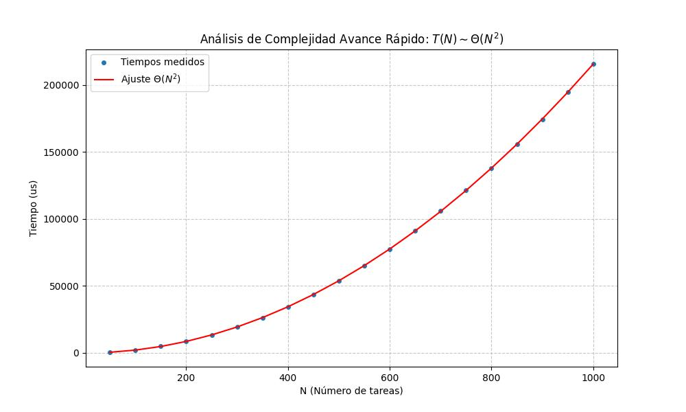
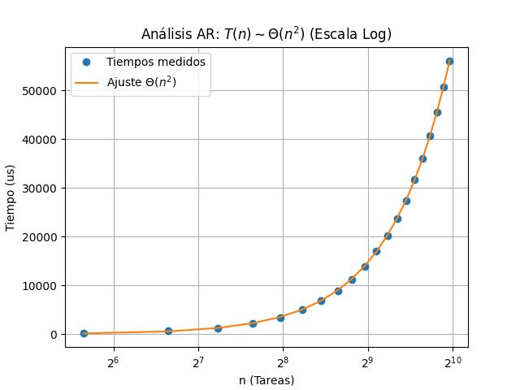

# 🔍 Análisis teórico (Avance Rápido)

Para el algoritmo voraz (Avance Rápido) aplicado al problema de programación de tareas, realizamos un análisis de complejidad basado en el conteo de operaciones de sus bucles anidados.

> **Nota sobre el Teorema Maestro:** El Teorema Maestro se aplica específicamente a algoritmos que siguen la estrategia de "Divide y Vencerás" (recursivos). Dado que nuestro algoritmo de **Avance Rápido** es **iterativo**, su análisis se basa en la suma de las iteraciones de sus bucles.

## 🧮 Análisis de Complejidad

Definimos:
- $N$: Número de tareas.
- $M$: Número de máquinas.

El coste total $T(N, M)$ se desglosa en la lógica de selección de tareas:

### 1. Dinámica del Bucle Principal
El algoritmo asigna una tarea en cada iteración hasta completar las $N$ tareas. En cada paso, debe buscar la mejor combinación entre las tareas que aún no han sido asignadas:

- **Iteración 1:** Se comparan **$N$** tareas candidatas contra las $M$ máquinas. Coste: $N \cdot M$.
- **Iteración 2:** Quedan **$N-1$** tareas candidatas. Coste: $(N-1) \cdot M$.
- **Iteración 3:** Quedan **$N-2$** tareas candidatas. Coste: $(N-2) \cdot M$.
- ...
- **Iteración $N$:** Solo queda **$1$** tarea candidata. Coste: $1 \cdot M$.

### 2. Cálculo de la Suma de Operaciones
Si sumamos el esfuerzo de todas las iteraciones, podemos extraer $M$ como factor común:

$$ T(N, M) = M \cdot [N + (N-1) + (N-2) + \dots + 1] $$

La expresión entre corchetes es la **Suma de Gauss** para los primeros $N$ números naturales, cuya fórmula es $\frac{N(N+1)}{2}$. Sustituyendo:

$$ T(N, M) = M \cdot \frac{N(N+1)}{2} = \frac{M \cdot N^2 + M \cdot N}{2} $$

### 🚀 Complejidad Final
En el análisis asintótico (notación Big-O), despreciamos las constantes y los términos de menor orden ($M \cdot N$):

$$ T(N, M) \in \Theta(N^2 \cdot M) $$

---

## 🔬 Análisis experimental y Contraste

Para validar el modelo teórico, se ha realizado una regresión lineal sobre los tiempos medidos. Dado que $M$ se mantuvo constante ($M=10$), el modelo se ajusta a: $T(N) = c \cdot N^2 + d$.

Los resultados obtenidos son:
- **Coeficiente de determinación ($R^2$):** $0.999994$

Un valor de $R^2$ prácticamente igual a 1 confirma que el algoritmo se comporta exactamente como predice el análisis teórico, siguiendo una complejidad cuadrática respecto a $N$.

| Regresión lineal (Escala Lineal) | Regresión lineal (Escala Logarítmica) |
|---|---|
|  |  |
