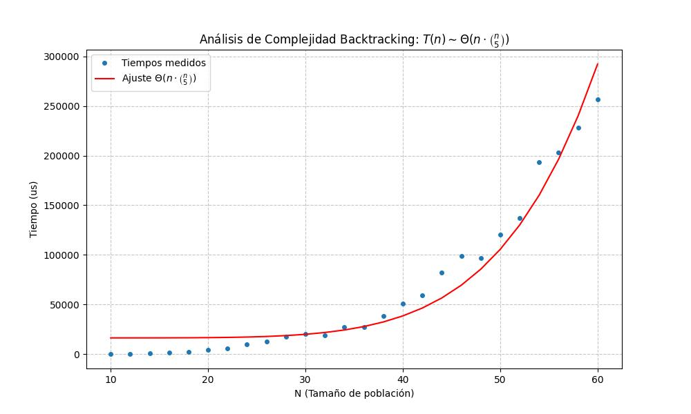
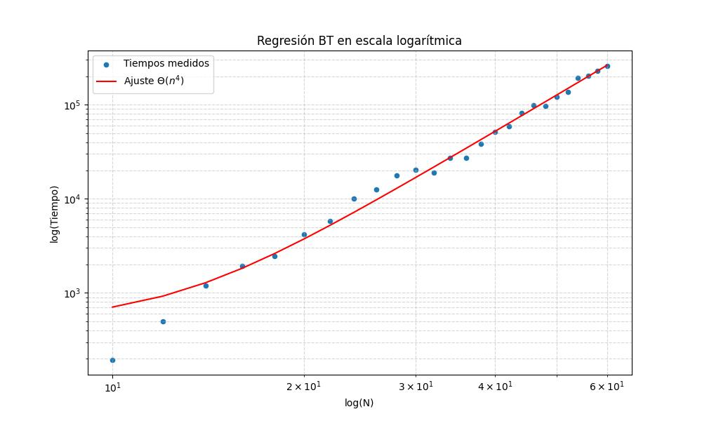

# 🔍 Análisis teórico (Backtracking)

El algoritmo de Backtracking para el problema de **Máxima Diversidad** explora un espacio de estados basado en decisiones binarias (incluir o no incluir un elemento) para cada uno de los $n$ elementos disponibles.

## 🌳 El Espacio de Estados: De lo Exponencial a lo Polinomial

### 1. La Base Teórica (Peor Caso)
Sin ninguna restricción, el algoritmo generaría todas las combinaciones posibles de elementos ($2^n$). Al final de cada rama (hoja), calcularía el valor de diversidad con un coste de $O(m^2)$. Esto nos daría una complejidad de $O(m^2 \cdot 2^n)$, que es **exponencial** e intratable para $n=60$.

### 2. El Impacto de las Podas (Bounding)
Nuestra implementación es mucho más eficiente gracias a que "corta" ramas del árbol antes de llegar al final:

- **Poda por Tamaño ($m$):** Es la más potente. El algoritmo solo desciende por ramas que tienen la posibilidad de sumar exactamente $m$ elementos. Esto reduce el espacio de búsqueda de $2^n$ a combinaciones de $n$ sobre $m$ ($\binom{n}{m}$). Para un $m$ pequeño (como $m=5$), esta función se comporta como un polinomio de grado $m$.
- **Poda por Cota Superior:** Antes de explorar un nodo, estimamos la diversidad máxima que podríamos conseguir si el resto de elementos fueran perfectos. Si esa estimación no supera la mejor solución actual (`voa`), descartamos la rama entera.

### 3. Complejidad Práctica Estimada
Debido a que $m$ es constante y pequeño, y a que la poda por cota superior es muy agresiva, el algoritmo deja de crecer de forma exponencial y se comporta como un polinomio de grado bajo:

$$ T(n) \approx \Theta(n^{m-1}) \rightarrow \Theta(n^4) $$

---

## 🔬 Análisis experimental y Contraste

Para validar este modelo, se ha realizado una regresión lineal sobre los tiempos medidos manteniendo $m=5$ constante. El modelo de ajuste utilizado ha sido $T(n) = c \cdot n^4 + d$.

Los resultados obtenidos son:
- **Coeficiente de determinación ($R^2$):** $0.993212$

### ¿Por qué $R^2 = 0.99$ y no 1?
A diferencia del algoritmo voraz, el tiempo en Backtracking depende de la **calidad de los datos**. Si la matriz tiene distancias que permiten podar pronto, el algoritmo termina antes. Esa pequeña variabilidad (ruido) es lo que hace que el ajuste no sea un 1 perfecto, pero un **0.99** es una evidencia estadística abrumadora de que el comportamiento es polinomial ($n^4$).

| Regresión lineal (Escala Lineal) | Regresión lineal (Escala Logarítmica) |
|---|---|
|  |  |

### ⚖️ Justificación de la Eficiencia
El uso de Backtracking con podas permite resolver de forma exacta un problema que de otro modo requeriría billones de operaciones, manteniéndose en tiempos de ejecución de pocos milisegundos para los tamaños de problema requeridos.
